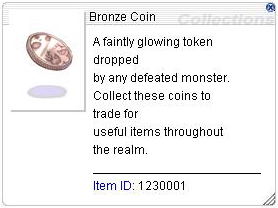
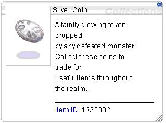
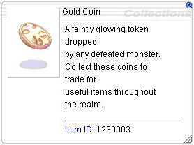

## Bronze Coin
#### A basic currency commonly found across the world of RetRO, dropped by most monsters with a 5% chance. 
#### The following monsters are excluded from dropping Bronze Coins: 
  - Orc Zombie
  - Thief Bug Female
  - Thief Bug Male
  - Familiar
  - Hydra
  - Thief Bug Egg
  - Peco Peco Egg
  - Ant Egg
  - Red Plant
  - Blue Plant
  - Green Plant
  - Yellow Plant
  - White Plant
  - Shining Plant
  - Thief Bug
  - Tarou
  - Mandragora
  - Plankton  
#### Players with an active Homunculus will not trigger Bronze Coin drops.  

## Silver Coin
#### A refined currency awarded through server events and special challenges. 

## Gold Coin
#### A rare and prestigious currency, dropped by almost every MVP monsters. 

